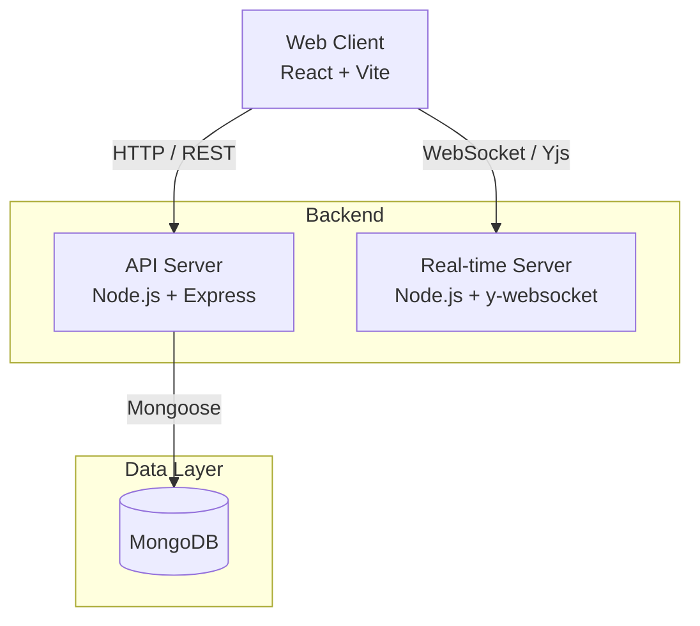
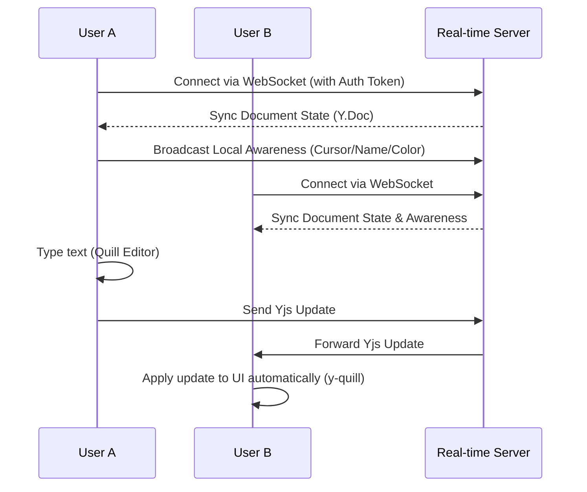

# Real-Time-Workspace

A MERN-based real-time collaborative editor built with React, Node.js, MongoDB, WebSockets, and Yjs (CRDT).  
The project targets Google Docs-like collaboration: multi-user editing, live cursor presence, conflict-free sync, and a dashboard for managing documents and invites.

## Tech Stack

- **Frontend:** React + Vite + Tailwind + Quill Editor
- **API:** Node.js + Express + JWT auth + document/collaborator ACL (`apps/api`)
- **Realtime:** Node.js + WebSocket + Yjs (`apps/realtime`)
- **Database:** MongoDB ([Atlas](https://www.mongodb.com/atlas) recommended)
- **Monorepo:** pnpm workspaces + Turborepo

## System Architecture



### Real-Time Collaboration Flow



## Monorepo Structure

```text
apps/
  web/        # React client (Dashboard, Editor, Auth)
  api/        # REST API (auth, documents, collaborators, invites)
  realtime/   # WebSocket/Yjs server for syncing edits & presence
packages/
  shared/     # Shared types/contracts
docs/
  real-time-workspace-execution-plan.md
  adr/
    0001-authentication.md
infra/
  docker-compose.yml
```

## Prerequisites

- Node.js (recommended: 20 LTS)
- pnpm
- Docker (optional local Mongo via compose profile)

## Environment Variables

Copy `.env.example` to `.env` at the repo root and set:

| Variable | Purpose |
|----------|---------|
| `MONGO_URI` | MongoDB connection string. For Atlas use `mongodb+srv://.../dbname?...` |
| `JWT_ACCESS_SECRET` | Secret for signing **access** JWTs |
| `JWT_REFRESH_SECRET` | Secret for signing **refresh** JWTs |
| `PORT` | API listen port (defaults to **4000** in `apps/api` if unset) |
| `API_PORT` | Documented convention / tooling; align with `PORT` for local runs |
| `RT_PORT` | Realtime port (defaults to **4001**) |
| `WEB_PORT` | Vite dev port |
| `NODE_ENV` | `development` / `production` |

## Auth API (`/api/auth`)

Base URL: `http://localhost:<PORT>/api/auth` (default port **4000**).

| Method | Path | Auth | Description |
|--------|------|------|-------------|
| `POST` | `/register` | — | Creates **User** + **Profile**; returns `{ profile }` (no tokens — client typically logs in next) |
| `POST` | `/login` | — | Returns `{ accessToken, profile }`; sets refresh **httpOnly** cookie `token` |
| `POST` | `/logout` | — | Clears refresh cookie |
| `POST` | `/refresh` | Refresh cookie | Returns new `{ accessToken }`, rotates refresh cookie |
| `GET` | `/me` | `Authorization: Bearer <access>` | Loads **Profile** for the current user |

## Documents API (`/api/documents`)

All routes require **`Authorization: Bearer <access>`** (`requireAuth`).

| Method | Path | Description |
|--------|------|-------------|
| `GET` | `/` | Lists documents the user **owns** or **collaborates** on; each item includes a `permissions` summary |
| `GET` | `/:id` | Single document (read: owner or collaborator) |
| `POST` | `/` | Create document (caller becomes **owner** via `ownerId` = JWT `profileId`) |
| `PUT` | `/:id` | Update title/content (**owner** or **editor** collaborator) |
| `DELETE` | `/:id` | Delete document (**owner** only) |

## Collaborators API (`/api/documents/:documentId/collaborators`)

Mounted with **`mergeParams`** so `documentId` is available on nested routes. All routes require **Bearer** auth.

| Method | Path | Description |
|--------|------|-------------|
| `GET` | `/` | List collaborators for the document (+ owner in enriched payload) |
| `GET` | `/:id` | Single membership row — `:id` is the **Collaborator** document `_id` |
| `POST` | `/` | Add collaborator (**owner** only); body includes `profileId`, `role` (`editor` \| `viewer`) |
| `PUT` | `/:id` | Update role — `:id` = Collaborator `_id` (**owner** only) |
| `DELETE` | `/:id` | Remove collaborator — `:id` = Collaborator `_id` (**owner** only) |
| `DELETE` | `/leave/me` | Logged in user leaves the document as a collaborator |

## Invites API (`/api/invites`)

All routes require **`Authorization: Bearer <access>`**.

| Method | Path | Description |
|--------|------|-------------|
| `GET` | `/` | List pending invites for the current user |
| `POST` | `/documents/:documentId` | Invite a user to a document (**owner** only) |
| `POST` | `/:id/accept` | Accept an invite and join document as collaborator |
| `POST` | `/:id/reject` | Reject/decline an invite |

## Local Development

1. Install dependencies:

```bash
pnpm install
```

2. Start infra:

- **MongoDB:** [Atlas](https://www.mongodb.com/atlas) (`MONGO_URI` in `.env`), **or** local Mongo:

```bash
docker compose -f infra/docker-compose.yml --profile local-mongo up -d
```

3. Start all apps from repo root:

```bash
pnpm dev:all
```

### Service URLs

- Web: `http://localhost:5173` (or the port in `apps/web` dev script)
- API health: `http://localhost:4000/health` (or your `PORT`)
- Realtime WS: `ws://localhost:4001` (when `apps/realtime` is running)

## Root Scripts

- `pnpm dev:all` - Run all app `dev` tasks through Turbo
- `pnpm build:all` - Build all packages/apps
- `pnpm lint:all` - Lint all packages/apps
- `pnpm typecheck:all` - Run TypeScript checks across workspace

## Current Status

- **Phase 1 — Auth:** User + Profile, JWT access + refresh cookie, `profileId` on tokens.
- **Phase 2 — Documents + ACL (API):** Document CRUD; nested collaborator routes; invite system with notifications.
- **Phase 3 — Realtime:** Realtime room auth, Yjs collaborative sync, cursor awareness, UI live syncing.

## Roadmap

1. ~~Auth foundation~~
2. ~~Document CRUD + ACL (REST)~~
3. ~~Realtime room auth + presence events~~
4. ~~Yjs collaborative sync + cursor awareness~~
5. Snapshot persistence + version history restore
6. Production hardening (Redis scale-out, security, tests, observability)

Detailed plan: [docs/real-time-workspace-execution-plan.md](docs/real-time-workspace-execution-plan.md).
